# [ICML 2026] Scaling the Prior: Size-Consistent Geometric Diffusion for 3D Molecular Generation

Wenhan Gao, Jingxiang Qu, Yi Liu

Forty-third International Conference on Machine Learning (ICML), 2026

<p align="center">
  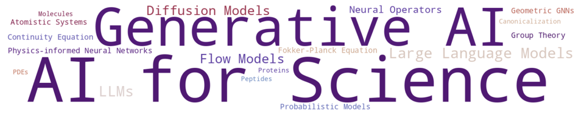
</p>

A [quick overview of the paper](#quick-overview) is included at the bottom of this readme file


## Enviroments
- Setup the anaconda (skip this if you already have conda)
```bash
mkdir -p ~/miniconda3
wget https://repo.anaconda.com/miniconda/Miniconda3-latest-Linux-x86_64.sh -O ~/miniconda3/miniconda.sh
bash ~/miniconda3/miniconda.sh -b -u -p ~/miniconda3
rm ~/miniconda3/miniconda.sh
source ~/miniconda3/bin/activate
```
- Create a conda enviroment
```bash
conda create -n StP python=3.12
conda deactivate # Make sure no other conda enviroment is activated
conda activate StP
```

-  Install the required python packages
```bash
pip install torch==2.4.0 torchvision==0.19.0 torchaudio==2.4.0 --index-url https://download.pytorch.org/whl/cu118
pip install numpy==2.1.2
pip install rdkit==2024.3.2
pip install roma==1.5.4
pip install scipy==1.16.2
pip install wandb==0.21.4
pip install matplotlib==3.10.0
pip install imageio==2.37.0
pip install msgpack==1.1.1
pip install timm==1.0.19
pip install gdown
```

## Preparing Dataset
- QM9
	- The dataset will automatically be downloaded and processed the first time you run the code
 - 
-GEOM-Drugs
	- Download the file at https://dataverse.harvard.edu/file.xhtml?fileId=4360331&version=2.0   (Warning: 50gb):
		`wget https://dataverse.harvard.edu/api/access/datafile/4360331`
	- Untar it and move it to `StP/processed_dataset/geom/`.: `tar -xzvf 4360331`
	- `pip install msgpack`
	- `python3 build_geom_dataset.py`
	- After processing, there should be a `geom_drugs_30.npy` file under `StP/processed_dataset/geom/`

	
## Train and Eval
- You can turn on/off `StP` or `data_norm` by `--StP` or `--data_norm`; the default is off. The following bash commands are for training with StP.
- For both quality (`eval_analyze.py`) and structure (`eval_structure_qm9.py`) evaluation, just change the model path to evaluate different models. 

### EDM
- EDM-StP on QM9:

```bash
cd EDM
python main_qm9.py --n_epochs 3000 --n_stability_samples 1000 --diffusion_noise_schedule polynomial_2 --diffusion_noise_precision 1e-5 --diffusion_steps 1000 --diffusion_loss_type l2 --batch_size 64 --nf 256 --n_layers 9 --lr 1e-4 --normalize_factors [1,4,10] --test_epochs 20 --ema_decay 0.9999 --n_report_steps 800 --no_wandb --StP --exp_name edm_qm9_StP
python eval_analyze.py --model_path outputs/edm_qm9_StP/nll --n_samples 10_000
python eval_structure.py   --model_path outputs/edm_qm9_StP/nll/   --n_reference 10000   --n_generated 10000   --batch_size 100   --batch_size_gen 100   --reference_cache ../processed_dataset/qm9/qm9_geometry_ref.pkl
```

- EDM-StP on GEOM-Drugs
```bash
cd EDM
python main_geom_drugs.py --n_epochs 60 --n_stability_samples 500 --diffusion_noise_schedule polynomial_2 --diffusion_steps 1000 --diffusion_noise_precision 1e-5 --diffusion_loss_type l2 --batch_size 64 --nf 256 --n_layers 4 --lr 1e-4 --normalize_factors [1,4,10] --test_epochs 1 --ema_decay 0.9999 --n_report_steps 1000 --normalization_factor 1 --model egnn_dynamics --visualize_every_batch 10000 --no_wandb --StP --exp_name edm_drugs_StP
python eval_analyze.py --model_path outputs/edm_drugs_StP --n_samples 10_000
python eval_structure.py   --model_path outputs/edm_drugs_StP   --n_reference 10000   --n_generated 10000   --batch_size 100   --batch_size_gen 100   --reference_cache ../processed_dataset/geom/geom_geometry_ref.pkl
```


### RADM
- Note: RADM weights are large, so you might want to delete/modify the lines of code responsible for saving intermediate checkpoints in the main training scripts (`qm9_ldm.py` and `drugs_ldm.py`)
- To train RADM-StP, we first obtain the [pretrained autoencoders from the original authors](https://github.com/skeletondyh/RADM):
```bash
cd RADM/outputs
gdown https://drive.google.com/uc?id=15s2JgYPgFUgWVd2ZaZB8snh7G86cGTbD 
gdown https://drive.google.com/uc?id=1R7eF6ung_294vdThQqnVOrcFLoxzGdL7 
tar -xvzf qm9_ae.tar.gz
tar -xvzf drugs_ae.tar.gz
```

- RADM-StP on QM9:
```bash
cd RADM
python qm9_ldm.py --n_epochs 6000 --n_stability_samples 1000 --diffusion_noise_schedule polynomial_2 --diffusion_noise_precision 1e-5 --diffusion_steps 1000 --diffusion_loss_type l2 --batch_size 256 --lr 1e-4 --test_epochs 20 --ema_decay 0.9999 --latent_nf 1 --size base --ae_path ./outputs/qm9_ae --no_wandb --dp True --StP --exp_name radm_qm9_StP
python eval_analyze.py --model_path outputs/radm_qm9_StP/nll --n_samples 10000
python eval_geometry_qm9.py   --model_path outputs/radm_qm9_StP/nll   --n_reference 10000   --n_generated 10000   --batch_size 100   --batch_size_gen 100   --reference_cache ../processed_dataset/qm9/qm9_geometry_ref.pkl
```

- RADM-StP on GEOM-Drugs:
```bash
python drugs_ldm.py --n_epochs 60 --n_stability_samples 500 --diffusion_noise_schedule polynomial_2 --diffusion_steps 1000 --diffusion_noise_precision 1e-5 --diffusion_loss_type l2 --batch_size 256 --lr 1e-4 --test_epochs 1 --ema_decay 0.9999 --latent_nf 2 --size base --ae_path ./outputs/qm9_ae --no_wandb --dp True --StP --exp_name radm_drugs_StP
python eval_analyze.py --model_path outputs/radm_drugs_StP --n_samples 10000
CUDA_VISIBLE_DEVICES=0 python eval_geometry_qm9.py   --model_path outputs/radm_drugs_StP   --n_reference 10000   --n_generated 10000   --batch_size 100   --batch_size_gen 100   --reference_cache ../processed_dataset/geom/geom_geometry_ref.pkl
```

### GeoLDM

- GeoLDM on QM9:

```bash
python main_qm9.py --n_epochs 3000 --n_stability_samples 1000 --diffusion_noise_schedule polynomial_2 --diffusion_noise_precision 1e-5 --diffusion_steps 1000 --diffusion_loss_type l2 --batch_size 64 --nf 256 --n_layers 9 --lr 1e-4 --normalize_factors [1,4,10] --test_epochs 20 --ema_decay 0.9999 --n_report_steps 800 --train_diffusion --trainable_ae --latent_nf 1 --no_wandb --StP --exp_name geoldm_qm9_StP
python eval_analyze.py --model_path outputs/geoldm_qm9_StP/nll --n_samples 10000
python eval_structure.py   --model_path outputs/geoldm_qm9_StP/nll/   --n_reference 10000   --n_generated 10000   --batch_size 100   --batch_size_gen 100   --reference_cache ../processed_dataset/qm9/qm9_geometry_ref.pkl
```

- GeoLDM on GEOM-Drugs:
```bash
python main_geom_drugs.py --n_epochs 60 --n_stability_samples 500 --diffusion_noise_schedule polynomial_2 --diffusion_steps 1000 --diffusion_noise_precision 1e-5 --diffusion_loss_type l2 --batch_size 32 --nf 256 --n_layers 4 --lr 1e-4 --normalize_factors [1,4,10] --test_epochs 1 --ema_decay 0.9999 --n_report_steps 1000 --normalization_factor 1 --model egnn_dynamics --visualize_every_batch 10000 --train_diffusion --trainable_ae --latent_nf 2 --no_wandb --StP --exp_name geoldm_drugs_StP
python eval_analyze.py --model_path outputs/geoldm_drugs_StP --n_samples 10000
python eval_geometry_qm9.py   --model_path outputs/geoldm_drugs_StP   --n_reference 10000   --n_generated 10000   --batch_size 100   --batch_size_gen 100   --reference_cache ../processed_dataset/geom/geom_geometry_ref.pkl
```

## Trained Models
- Trained models can be downloaded [here](https://drive.google.com/file/d/1gpyEJsI1rvANNqMgJTQ3mupZUcgKRnUm/view?usp=sharing) or use the command below
	- Unzip the file, put the folders containing weights and pickle files into the output folder of each model and follow the evaluation commands above, only changing the model path
```bash
gdown https://drive.google.com/uc?id=1gpyEJsI1rvANNqMgJTQ3mupZUcgKRnUm
```

## A summary of the changes made to the original code from EDM, GeoLDM, and RADM
- Parser Arguments: Included StP and data_norm (direct normalization of coordinates) in the training scripts (e.g., `main_qm9.py`)
- Directory overwrite check:
	- Before starting a run, the script checks whether the experiment directory (`outputs/{exp_name}`) already exists
	- If it does, the user is prompted to confirm overwriting to prevent accidental loss of previous results
- Dataset: We changed the directory for the GEOM-Drugs dataset for all models to use
- Diffusion Model: Implemented StP and data_norm
	- `qm9/models/get_model()`: Included StP and data_norm, passed into the diffusion models
	- StP is implemented during sampling from a zero-mean Gaussian: `utils.sample_center_gravity_zero_gaussian_with_mask()`
	- data_norm is implemented in `normalize()` and `unnormalize()` under `en_diffusion/EnVariationalDiffusion`
- Saving checkpoints:
	- We begin monitoring NLL and RDKit metrics after a certain number of epochs
	- We do not monitor test NLL during training to save training time
	- Checkpoints are saved based on two criteria: eval NLL and molecular validity
	- Whenever a new best score is achieved for either metric, the model state is saved as a checkpoint
	- For GEOM-Drugs, we do not check RDKit metrics nor save checkpoints based on them due to computational costs
	- **We still only evaluate the best NLL checkpoint for fair comparison**
- Added scripts for structure evaluation

## Quick Overview

### Introduction to Diffusion Models
- Diffusion models gradually convert data to pure Gaussian noise: $x_t=\alpha_{\mathrm{t}} x_0+\beta_t \epsilon, \epsilon \sim \mathcal{N}(\mathbf{0}, \mathbf{I})$
- Then train a neural network to reverse the process by denoising step by step
	- Generation: Pure Gaussian Noise ⟶ Realistic Data Samples
<p align="center">
  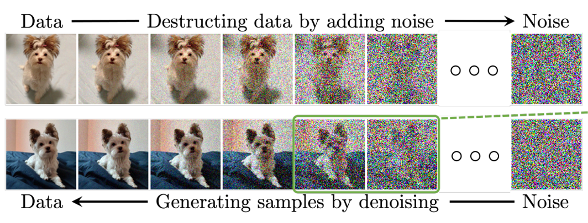
  <br>
  <em>Image Adopted From: https://arxiv.org/pdf/2209.00796v13</em>
</p>

- Diffusion models can generate high-quality and high-resolution images
	- The model generates a global layout and coarse shapes first
	- Then it adds high-frequency details, like hair strands, fine edges, etc.

<p align="center">
  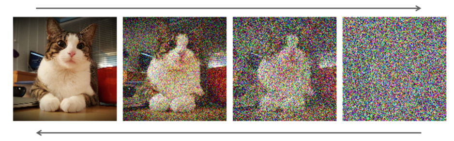
  <br>
  <em>Image Adopted From: https://arxiv.org/pdf/2209.00796v13</em>
</p>

- The mathematical framework of diffusion models assumes a fixed-dimensional metric space
	- e.g., images at a fixed resolution

<p align="center">
  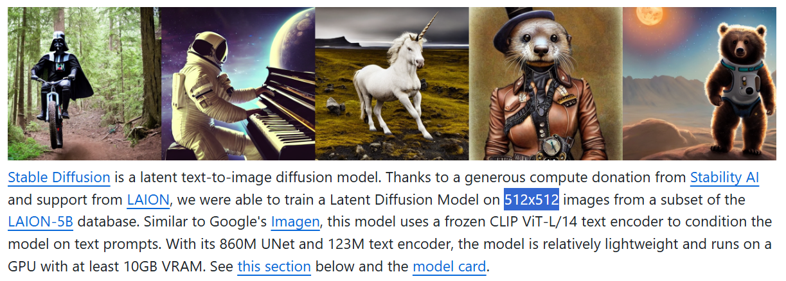
  <br>
  <em>Image created by snipping Stable Diffusion’s [official repo](https://github.com/compvis/stable-diffusion)</em>
</p>

### Introduction to 3D Molecular Generation

- We are interested in de novo generation of a molecule described by its 3D atomic coordinates and atom features (e.g., atom type)


<p align="center">
  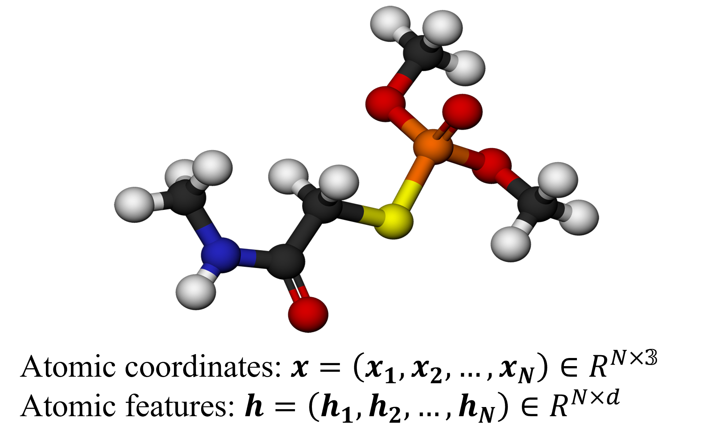
</p>

- **Challenge**: Molecules have different numbers of atoms (i.e., different sizes)
  - **Mitigation (not a solution)**: Use GNNs or Transformers
  
### Motivation of StP/ Issue in Existing Diffusion Models

- Doing tests on existing SOTA 3D molecular diffusion models, we found:
	- Larger molecules → Less data and higher structural complexity → Better performance?
	
<p align="center">
  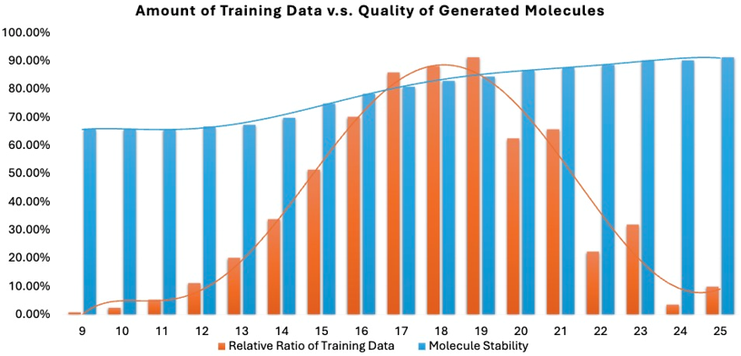
</p>
	
- **Why?** 
	- Variable-sized molecules introduce issues for diffusion models beyond size variability!
	- Molecules have different spatial scales!
	

<p align="center">
  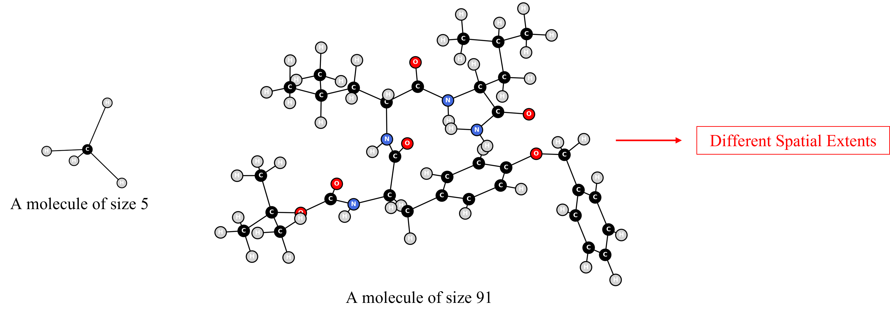
</p>

- Diffusion models can generate high-quality and high-precision atomic structures  
  - The model generates a <span style="color:#1e90ff;"><b>coarse structure</b></span> first  
  - Then it performs <span style="color:#ff0000;"><b>fine-grained adjustments</b></span> to positions
  
 <p align="center">
  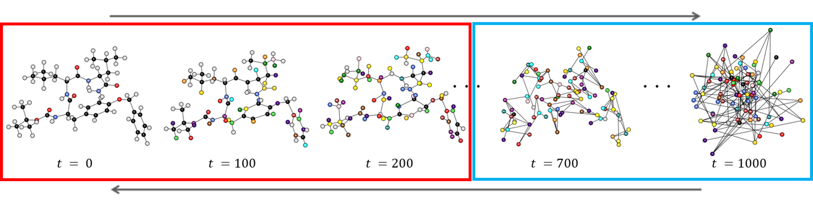
  <br>
  <em><span style="color:#1e90ff;"><b>Blue: Dominated by noise, the model tries to find a coarse structure;</b></span> <span style="color:#ff0000;">
<b>Red: Overall structure is clear, the model performs fine-grained adjustments.</b></span></em>
</p>

- **Issue**: Under the same noise schedule $x_t=\alpha_{\mathrm{t}} x_0+\beta_t \epsilon, \epsilon \sim \mathcal{N}(\mathbf{0}, \mathbf{I})$, different sizes of molecules get corrupted at different rates

<p align="center">
  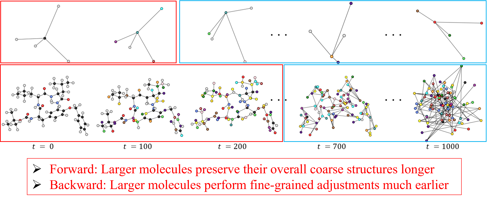
</p>

- As a result: Larger molecules → Stabilize earlier in the generative process → Better performance?

<p align="center">
  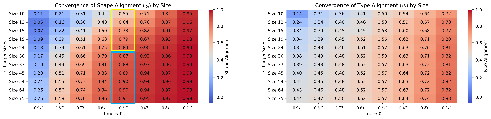
</p>


### The Simple Solution: Scaling the Prior
- **Issue**: Different spatial extents → Different effective noise levels 
	- **Solution**: Harmonize the noise levels → Gaussian distributions with different variances as the prior distribution for different sizes
- **In plain English**: We add less noise to smaller molecules and more noise to larger molecules

<p align="center">
  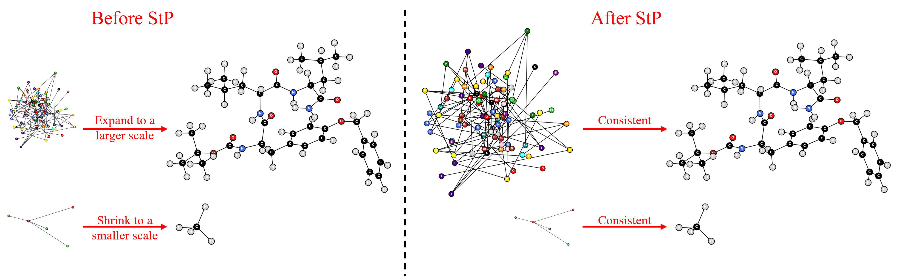
</p>

- Result: Improved quality as well as more aligned generative trajectories

<p align="center">
  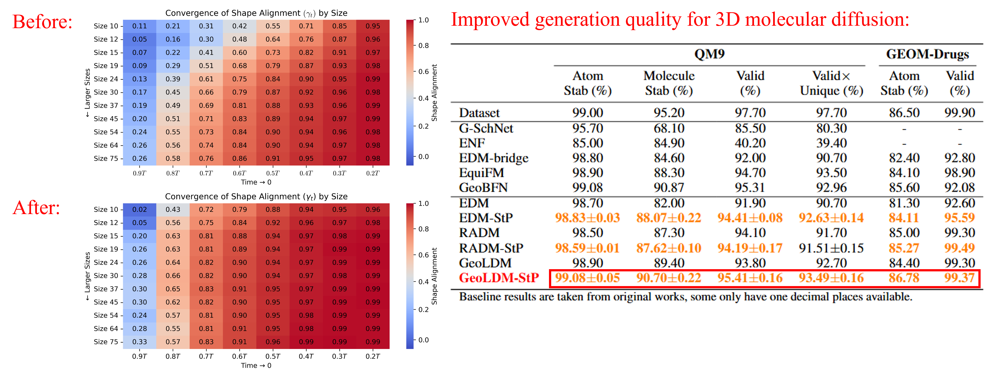
</p>

